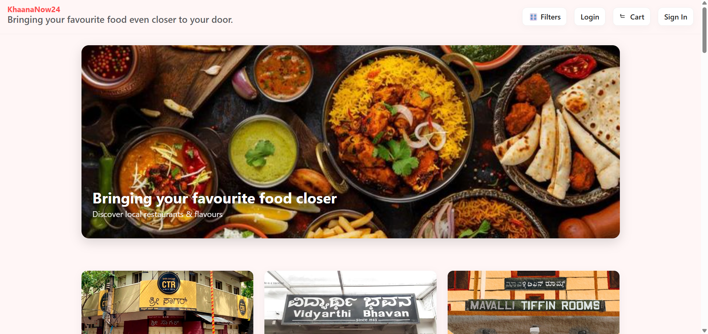
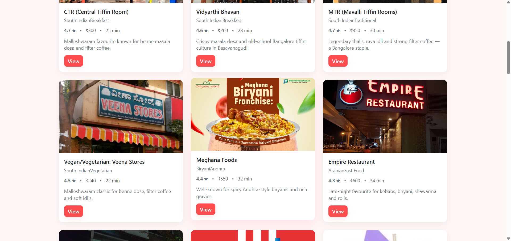
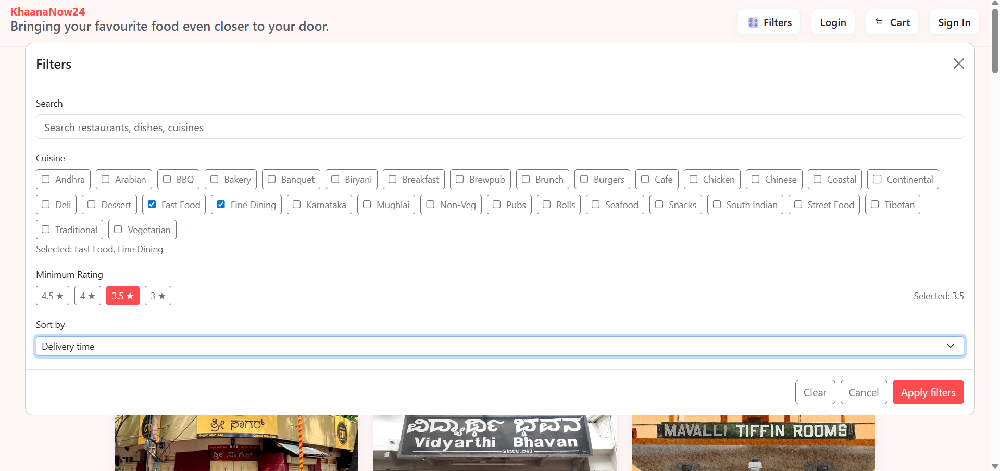
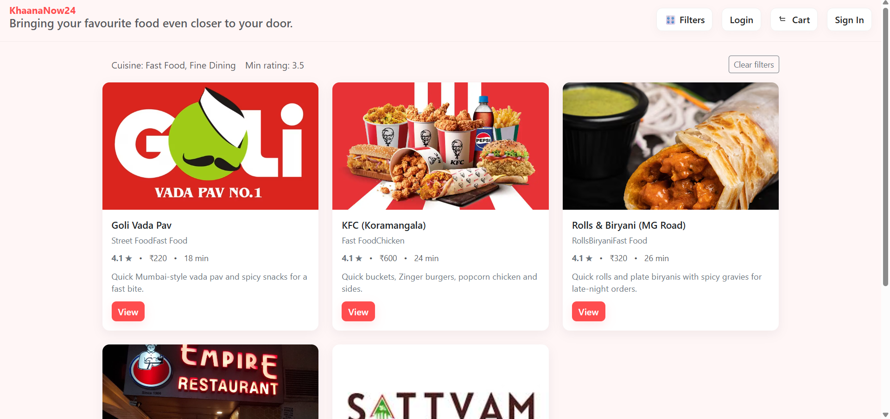
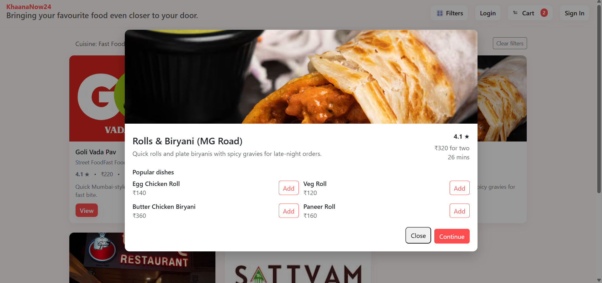
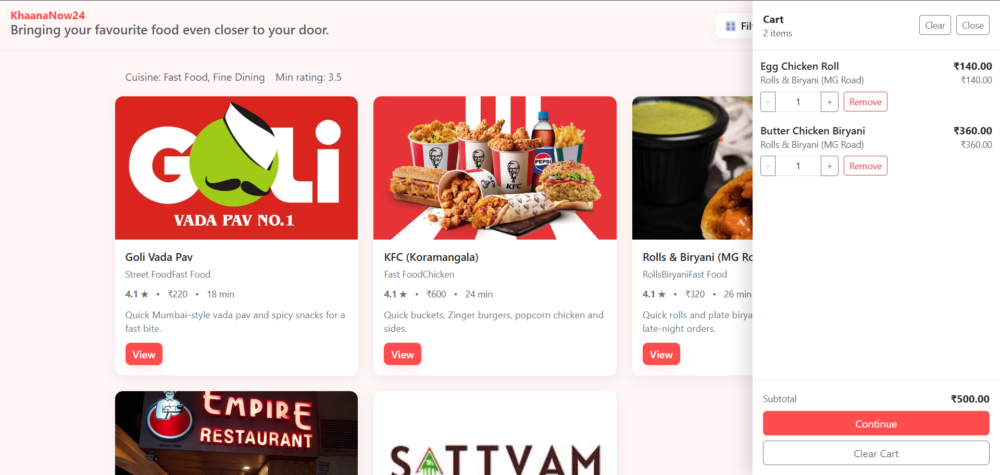

🍽️ KhaanaNow24 – Modern Restaurant Discovery Web App
React + TypeScript + Vite • Clean UI • Responsive • Filters • Cart System

KhaanaNow24 is a fast, modern, mobile-friendly restaurant discovery web application.
It allows users to browse restaurants, apply filters, view restaurant details, and manage an interactive cart — all implemented with a clean architecture and responsive UI.

---

## Features

### Hero Banner
- Beautiful responsive hero image showcasing the food theme.

### Restaurant Listings
- Clean card-based layout
- High-quality, uniform images
- Hover animations
- Fully responsive grid layout

### Advanced Filters
- Search by restaurant or menu name
- Filter by cuisine
- Filter by minimum rating
- Sort by rating, delivery time, or cost
- Responsive filter modal

### Cart System
- Toggleable cart sidebar
- Add/remove dish items
- Quantity controls
- Auto-calculated totals

### Restaurant Modal
- Detailed restaurant info
- Menu preview
- Responsive flexible grid
- Clean typography and spacing

### Perfect Responsiveness
- Optimized for all screen sizes:
  Mobile → Tablet → Desktop → Extra small screens

### Modern Styling
- Single consolidated App.css
- Utility-first classes for spacing, layout, and typography
- Smooth transitions
- Strong color palette using CSS variables

---

## Tech Stack

| Technology      | Purpose                      |
| --------------- | ---------------------------- |
| **React 18**    | UI Components                |
| **TypeScript**  | Safer code, type definitions |
| **Vite**        | Fast dev server + build      |
| **Bootstrap 5** | Layout utilities             |
| **Custom CSS**  | Final polished UI            |
| **Context API** | Cart state management        |
| **Local JSON**  | Static restaurant data       |

---

## Project Structure

restaurant-app/
│
├── public/
│   └── data/
│       └── restaurants.json
│
├── src/
│   ├── components/
│   │   ├── Hero.tsx
│   │   ├── RestaurantCard.tsx
│   │   ├── RestaurantModal.tsx
│   │   ├── FilterModal.tsx
│   │   ├── CartSidebar.tsx
│   │
│   ├── context/
│   │   └── CartContext.tsx
│   │
│   ├── hooks/
│   │   └── useRestaurants.ts
│   │
│   ├── types.ts
│   ├── App.tsx
│   ├── main.tsx
│   └── App.css           # Single stylesheet for the whole project
│
└── package.json

---

## How to Run

1. Install dependencies
   - npm install

3. Start development server
   - npm run dev

4. Open in browser
   http://localhost:5173

---

##  Preview

###  Home Page

### Home Restaurant Cards

###  Filters Modal

### Filtered Restaurant Cards

### Restauarnt Card View

###  Cart Sidebar

---

## Developer

Shaik Sulthan
Frontend Developer • React • TypeScript • UI/UX
